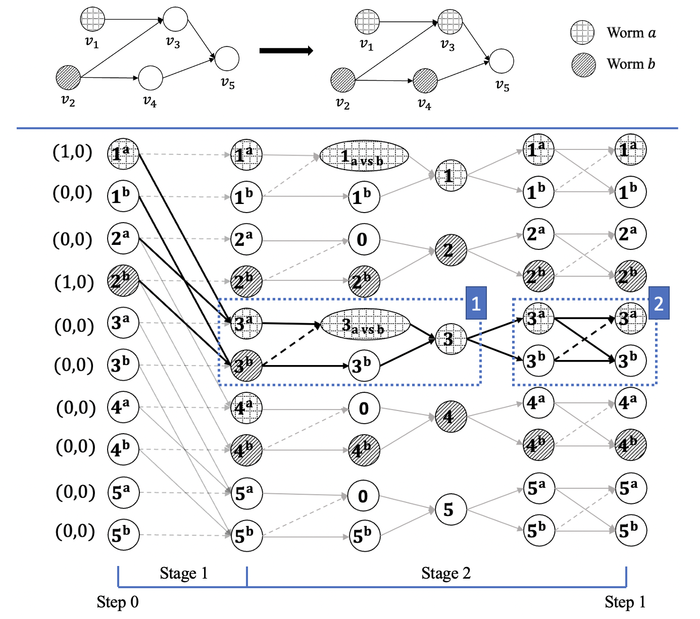

# CommunicationModelLearning
This repository holds the code for [Learning the Propagation of Worms in Wireless Sensor Networks](
https://arxiv.org/abs/2209.09984).

## Introduction

We study the dynamics of worms propagation across the WSN. A communication model is formulated for the multiple competitive worms diffusion. We simulate the spread process using complex neural network models and learn it by a back-propagation based algorithm. 


<p align="center"></p>

## Prerequisites
* `Python 3.8`
* `Pytorch 1.12.0`
* `ComplexPytorch 0.4`
* `scikit-learn 1.1.2`


## Training
Run the following command:
```
ComplexNN_Main_Run.py
```

